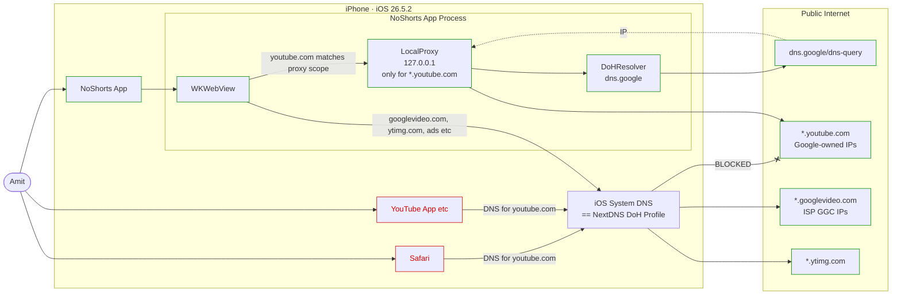

# NoShorts V2 — PRD, Implementation Plan, System Design

Status: **decided, ready to build**
Author: Amit Butala
Reviewer: Claude Code
Last edited: 2026-07-08

---

## 1. Context

NoShorts is a personal iOS app on Amit's iPhone (single user, single device).

It exists to solve one narrow problem: **Amit deliberately blocks `*.youtube.com` at the DNS layer on his phone via NextDNS** so that Safari, the YouTube app, and every other channel to YouTube on the device fails DNS resolution and shows an error. This is intentional friction to reduce his own YouTube usage — especially Shorts, algorithmic feed, and doom-scrolling.

NoShorts is the sanctioned escape hatch: **the only path on the phone that reaches YouTube**, and only in a shape Amit endorses — Playlists as the landing page instead of the algorithmic home, Shorts hidden across the app, a 30-minute session timer, forced landscape on `/watch`, autoplay off.

V1 (`NoShorts/NoShorts/` today, PRs #151/#153/#154/#155/#159/#176) shipped and worked from iOS 18 through iOS 25.x. On **iOS 26.5.2** playback broke: the in-app `LocalProxy` interacts badly with the OS's outbound-TCP handling and media segments from `*.googlevideo.com` fail with `Network is down` / `Connection reset by peer`.

V2 is a targeted rebuild that restores the V1 UX intent on iOS 26.5.2+, cleans up the accumulated cruft (the V1 code is honestly slop by now), and re-architects the DNS-bypass path to survive this and future iOS releases.

## 2. Users and non-users

**In scope:**

- Amit. iPhone 13 Pro, iOS 26.5.2, on residential Comcast Wi-Fi at home and cellular elsewhere. Personal Apple Developer signing (free tier).

**Explicitly not:**

- App Store distribution.
- iPad, macOS, Apple TV.
- Any other users of the phone (there aren't any).
- Multi-user session state.

## 3. Goals and non-goals

### Goals (MVP must)

- G1. Video playback works end-to-end on iOS 26.5.2 while NextDNS's `*.youtube.com` block remains active for the rest of the phone.
- G2. Safari, the YouTube app if reinstalled, and every non-NoShorts app on the phone continue to fail `*.youtube.com` — the NextDNS discipline is preserved.
- G3. V1's opinionated UX is retained: Playlists as landing, Shorts hidden, 30-minute session timer with hard exit, forced landscape on video, autoplay blocked.
- G4. The V2 codebase is small, understandable, and reads like a system a person could pick up in an hour — not the accumulated-workaround pattern of V1.

### Non-goals (MVP)

- N1. DRM / premium YouTube playback. Public content only. Explicit acceptance.
- N2. Downloading, offline playback, background audio for now.
- N3. Multi-account switching.
- N4. Ads: whatever YouTube serves inline is what plays. No ad-blocking.
- N5. iPad-adaptive layout.
- N6. Any dependency on a hosted service Amit doesn't run (no Piped, no yt-dlp on Vercel, no Cobalt). Zero external ops surface for MVP.

### Success criteria (definition of done)

- On Amit's iPhone with NextDNS active, opening NoShorts and tapping a video plays it.
- On the same phone, opening Safari and navigating to `youtube.com` still returns a NextDNS block page.
- All V1 UX behaviors listed in G3 are visibly working.

## 4. Constraints

- iOS 26.5.2. Assume 26.x will move forward and we may need to re-verify each point release.
- NextDNS profile is DNS-only (no VPN, no per-domain routing beyond simple deny lists). Only `*.youtube.com` is on the deny list.
- All other YouTube-adjacent domains — `*.googlevideo.com` (media), `*.ytimg.com` (thumbnails), `*.doubleclick.net` (ads) — resolve normally via NextDNS.
- Once we have an IP for `*.youtube.com`, TCP to that IP just works (V1 confirmed this repeatedly). The problem has always been DNS resolution.
- We must not require Amit to install a device-wide DNS override profile, because that would defeat G2.

## 5. Architecture

Per-app DoH bypass, scoped to a single domain matcher.



### Why this architecture solves the problem

- **Per-app scoping via `WKWebsiteDataStore.proxyConfigurations`.** The proxy is set on the NoShorts app's WKWebView's data store only. Safari and every other app on the phone are unaffected. NextDNS's deny remains fully enforced everywhere except inside our WKWebView. This is the mechanism that satisfies G2.
- **`ProxyConfiguration.matchDomains = ["youtube.com"]`.** Only traffic destined for `*.youtube.com` transits the LocalProxy. Everything else (`googlevideo.com`, `ytimg.com`, doubleclick, googleapis) goes direct from the WebContent process through system DNS. This is what V1 got wrong: V1 routed *everything* through the LocalProxy, and iOS 26.5.2 refuses to let the LocalProxy make outbound TCP to non-Google IPs (Xfinity-hosted `googlevideo.com` GGC edges, cellular-carrier CDN edges). Keep the proxy tightly scoped to Google-owned `youtube.com` IPs, which the OS is fine with.
- **`AVPlayer` / DRM / extractors are not in the picture.** WKWebView's built-in HTML5 player plays what YouTube serves. Simulator experiment on 2026-07-07 confirmed that WKWebView on iOS 26.5.2 loads YouTube's watch page normally including the video preview — the earlier "third-party WKWebView can't play YouTube" hypothesis was wrong; it was the proxy interaction all along.
- **Zero external services.** No Piped, no yt-dlp on a VPS, no aibo dependency. If it works, MVP has one moving part (the app) and one static config (dns.google DoH endpoint).

## 6. Implementation plan

### M0. Docs land

This PR. Establishes the shared understanding. No code changes yet.

### M1. Fresh V1 codebase

Amit approves either (a) clean up V1 in place or (b) delete `NoShorts/NoShorts/*.swift` and rewrite from scratch. Decision belongs to Amit. Everything below is written assuming (b) — from scratch — because the V1 code has accumulated JS wrappers, dead reverts, and workarounds that are more expensive to comprehend than replace.

New V2 code targets:

- `NoShortsApp.swift` — app entry, `AppDelegate` with orientation-lock plumbing.
- `ContentView.swift` — SwiftUI shell: WKWebView container, top/bottom toolbars, session-timer badge, orientation lock, JS injection registration.
- `LocalProxy.swift` — retained but **stripped**: only the CONNECT-tunnel path stays. No retry logic, no failover, no multi-endpoint DoH, no getaddrinfo bypass. Pure "receive CONNECT header, resolve via DoH, tunnel bytes."
- `DoHResolver.swift` — single endpoint (`dns.google`). Simple cache. First A record only. No AAAA, no round-robin, no fallback. If DoH fails, we surface a visible in-app banner.
- `README.md` — updated to describe V2 architecture. Old V1 IPA/Sideloadly docs preserved.

### M2. Wire the proxy scope

In `ContentView.swift`:

```swift
var proxyConfig = ProxyConfiguration(httpCONNECTProxy: endpoint, tlsOptions: nil)
proxyConfig.matchDomains = ["youtube.com"]  // per-app + per-domain scope
```

Plus:

```swift
config.mediaTypesRequiringUserActionForPlayback = .video
config.allowsInlineMediaPlayback = true
```

### M3. Simulator verification

- App launches, loads `feed/channels` (or `feed/playlists` — TBD in M4 based on which we pick as landing).
- Video preview thumbnails render.
- Tapping a video navigates to `/watch?v=…` and the WKWebView player renders.
- Chevron nav works, session timer counts down, orientation lock triggers on `/watch`.
- Iterate on the JS injection (autoplay wrapper, shorts hider) until visually clean.

Simulator can NOT confirm the NextDNS bypass — simulator uses the Mac's DNS. All the DNS-bypass semantics are on-device only.

### M4. One hardware test

- Install profile — none. Nothing is installed on the phone this time.
- Install V2 on the phone via Xcode's normal deploy.
- Confirm Safari on same phone: navigate to `youtube.com` → NextDNS block page. (Sanity check the block is still working.)
- Open NoShorts, tap a video from Playlists → verify it plays end-to-end.
- Verify NextDNS query log: only queries from the phone that touch `youtube.com` should originate from the NoShorts LocalProxy's DoH lookups (which go directly to `dns.google`, so NextDNS should see zero `youtube.com` queries at all).

### M5. Ship

- Squash to a clean commit, open PR, merge.
- Archive V1's code path in git history; the V1 branch stays reachable but nothing else references it.

## 7. Strategic fail-fast plan

If M4 fails (`matchDomains`-scoped LocalProxy doesn't actually play video on-device with NextDNS active), we do not iterate blindly. We ladder-down explicitly through these tiers:

**Tier 1 — Rule out simple confounders (30 minutes).**

Re-verify with:
- Airplane mode off / on cycle before test.
- `youtube.com` NextDNS deny is still active (visit in Safari and confirm block page).
- V2 build has `matchDomains` actually applied (log the `ProxyConfiguration` on startup and inspect device console).

If any of these were off, retry M4. If everything is right and it still fails, escalate.

**Tier 2 — Isolate whether the failure is in the LocalProxy's TCP or in WebContent's direct fetch (1 hour).**

Add temporary NSLog around every LocalProxy CONNECT and around WKNavigationDelegate URL loads. Play a video that fails. Compare console output to a video that plays.

If LocalProxy CONNECTs succeed for `youtube.com` and the failure is in WebContent trying to reach `googlevideo.com` direct, the problem has migrated. Investigate WebContent-side DNS or `googlevideo.com` reachability.

If LocalProxy CONNECTs fail, iOS 26 has further tightened outbound TCP from a proxy-configured app; matchDomains scoping is not enough, and we move to Tier 3.

**Tier 3 — Real Network Extension (1-2 days).**

Convert the DNS bypass to a `NEDNSProxyProvider` or `NEAppProxyProvider` Network Extension. This is per-app by design and doesn't rely on the WKWebView proxy config that iOS 26 keeps tightening. Requires the `com.apple.developer.networking.networkextension` entitlement. Apple often grants this for personal-signed apps but not always. Sideload workflow will need adjustment.

If entitlement is denied or the code turns into a treadmill, drop to Tier 4.

**Tier 4 — Give up on per-app scoping (10 minutes).**

Install a device-wide `.mobileconfig` DoH override for `*.youtube.com`. This defeats G2 (Safari can then reach YouTube too), but it's honest and it works. NoShorts becomes a thin UX layer instead of a discipline device. Amit's call whether to accept this trade-off.

**Tier 5 — Shelve V2.**

Watch YouTube on a different device (laptop, Apple TV) for the foreseeable. Come back when iOS 27 ships and re-evaluate. This is the only tier that involves not shipping.

**Explicit non-plan:** we do NOT chase the "self-hosted yt-dlp on aibo" path unless Tier 4 is also unacceptable AND Amit signs up for the ongoing maintenance treadmill. It's over-scoped for MVP.

---

## Appendix A — Things tried in this session and what happened

Chronological summary of the 2026-07-06 → 2026-07-08 debugging session, so we don't relitigate later.

**V1's original break mode** — On iOS 26.5.2, LocalProxy CONNECTs to `youtube.com` (Google IPs) succeed, but CONNECTs to `googlevideo.com` (Xfinity/cellular-carrier GGC IPs) fail with `Network is down` or `Connection reset by peer` mid-tunnel. iOS 26.5.2 apparently blocks proxy-originated outbound TCP to non-Google IPs from a third-party app. Same behavior on Comcast Wi-Fi and cellular — different edge IPs, same failure.

**Failed approaches (do not repeat):**

- `.mobileconfig` device-wide DoH override — works but defeats G2.
- Bumping DoH resolver to Cloudflare — same failure mode.
- Adding AAAA records + round-robin in DoHResolver — made it worse (v6 unreachable = ENETDOWN).
- Bypassing LocalProxy for `googlevideo.com` hostnames via `NWEndpoint.Host(name)` — still ENETDOWN.
- Forcing v4-only NWParameters on the bypass path — still ENETDOWN.
- `getaddrinfo` with `AF_INET` for hostname resolution — still ENETDOWN.
- Multi-endpoint DoH (Google + Cloudflare merged answers) — DoH consistently returns a single per-video edge IP for `rr*.googlevideo.com`, so multi-endpoint doesn't produce alternate candidates.
- Multi-IP failover retry in `openTunnel` — no candidates to fail over to.
- Removing/restoring the JS `.play()` wrapper — cosmetic; not a fix.
- Bumping fake UA from iOS 17 to iOS 26 — made things worse (playback fails at start instead of after 2s).
- `allowsInlineMediaPlayback = true` — meaningful hygiene fix, but insufficient alone.

**External backends investigated (all abandoned):**

- Piped — nearly every public instance offline or misconfigured as of 2026-07-07. The flagship `pipedapi.kavin.rocks` returns Cloudflare 526. `pipedapi.projectsegfau.lt` returns literal string "Piped has shutdown".
- Invidious — most public instances return 403 or are gated behind anti-bot challenges (Anubis, Turnstile).
- Cobalt — public API is JWT+Turnstile-gated for their own frontend; not usable from a third-party app without self-hosting.
- Yozora (Vercel-hosted `yt-dlp`) — returns "Sign in to confirm you're not a bot" because YouTube blocks datacenter IPs. Any free serverless deploy of `yt-dlp` hits the same wall.
- Yattee v1 — removed from App Store 2026-01-13. Yattee 2 is in TestFlight beta, moving target.

**What we haven't tried but noted for later:**

- `NEDNSSettingsManager` with per-app scoping via network extension. Not the same as WKWebView proxy config; may work where WKWebView proxy config doesn't. Requires entitlement.
- Screen Time / Content & Privacy Restrictions app allowlist — this is discipline-level, not networking-level; not obviously applicable.
- Self-hosted Piped on aibo — a real fallback but adds ongoing ops.
- Self-hosted `yt-dlp` HTTP wrapper on aibo (residential IP, so YouTube doesn't rate-limit) — same shape as Piped, less code but more upkeep.
- `WKURLSchemeHandler` intercepting `youtube.com` requests and DoH-resolving in-app before making the connection ourselves — theoretically viable but more invasive than matchDomains.

## Appendix B — Simulator diagnostic (2026-07-07)

Ran a controlled test in the iOS Simulator (iPhone 17 Pro, iOS 26.5): took the V1 codebase, stripped all user scripts, stripped the LocalProxy setup entirely, loaded `https://www.youtube.com/watch?v=jNQXAC9IVRw` directly.

Result: **watch page rendered fully** — video thumbnail, play button, title, uploader, view count, comments, related videos. Autoplay attempt (via `mediaTypesRequiringUserActionForPlayback = []`) hit a Playback-ID error, but that's YouTube's normal response to programmatic autoplay in any browser and is not indicative of a fundamental app restriction.

This kills the earlier hypothesis that "third-party WKWebView on iOS 26 can't play YouTube." It cannot play YouTube *when a LocalProxy is misconfigured or over-scoped*, which is a different failure mode.

Simulator does not have NextDNS active, so this experiment did not test the DNS-bypass path. It only established that the WKWebView player itself is fine.

## Appendix C — Files that will be touched in Phase C

- `NoShorts/NoShorts/NoShortsApp.swift` — keep mostly.
- `NoShorts/NoShorts/ContentView.swift` — rewrite.
- `NoShorts/NoShorts/LocalProxy.swift` — retain, strip aggressively.
- `NoShorts/NoShorts/DoHResolver.swift` — retain, strip aggressively.
- `NoShorts/README.md` — update sections about DNS bypass and remove stale claims. Preserve IPA/Sideloadly docs.
- `NoShorts/scripts/build_ipa.sh` — unchanged.

The Xcode project structure (`NoShorts.xcodeproj`) is unchanged. Same bundle ID, same signing.
